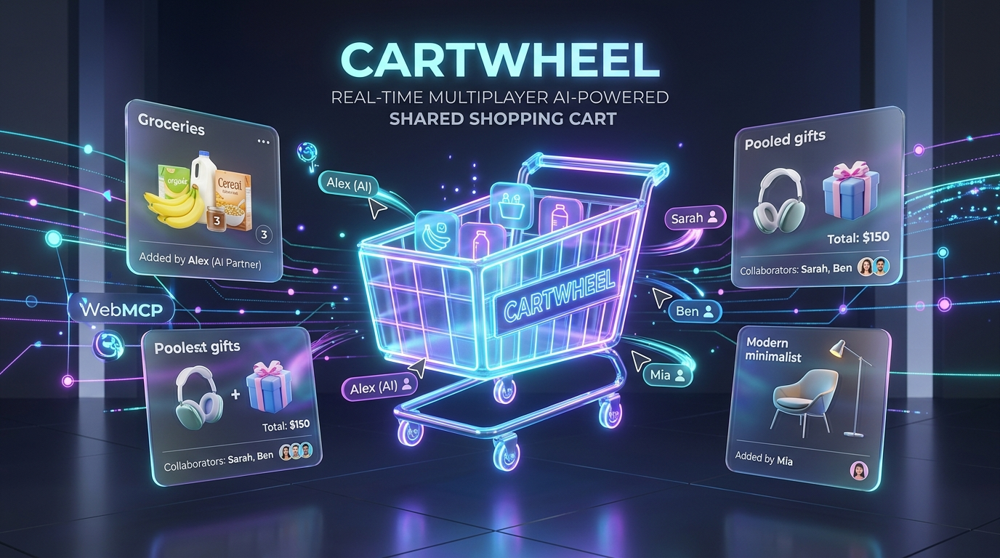
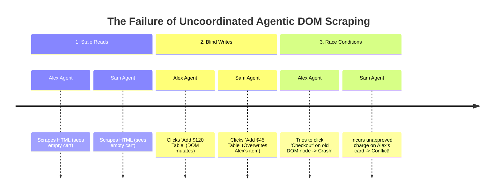
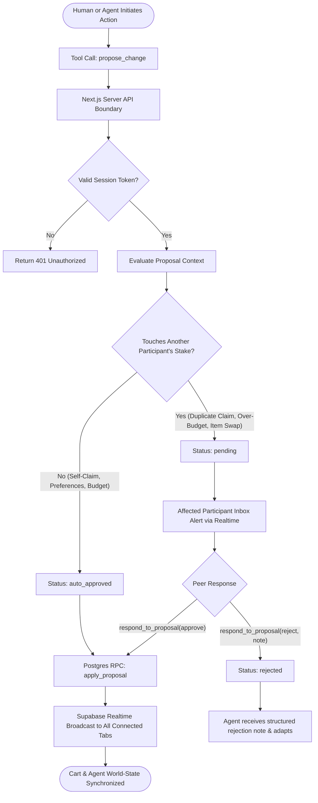
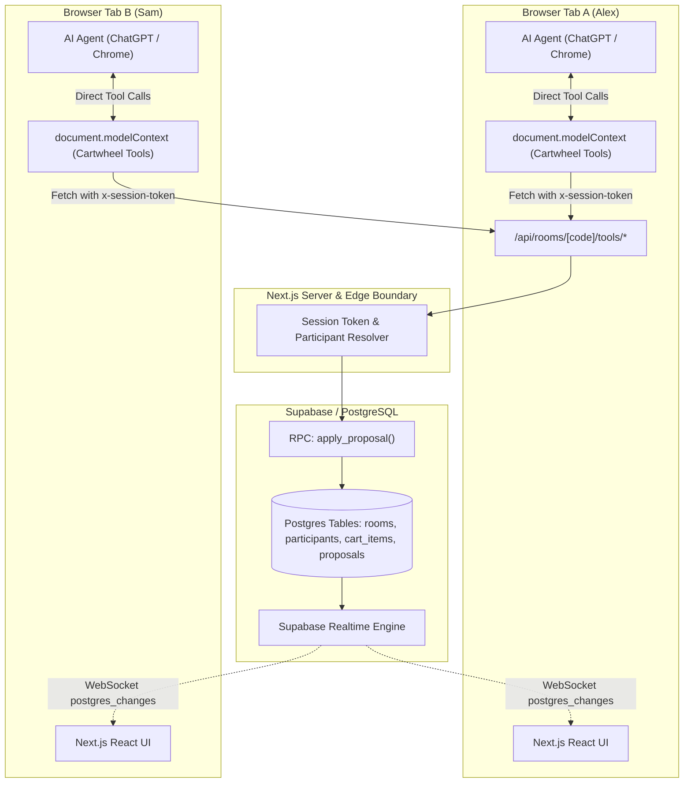

<p align="center">
  
</p>

# 🛒 Cartwheel

<p align="center">
  <strong>Multiplayer, Real-Time AI Shared Shopping Powered by WebMCP</strong>
</p>

<p align="center">
  <a href="#-the-story-why-cartwheel-exists"></a>
  <a href="#-tech-stack--architecture"></a>
  <a href="#-tech-stack--architecture"></a>
  <a href="#-tech-stack--architecture"></a>
  <a href="#-testing--verification"></a>
  <a href="./LICENSE"></a>
</p>

---

## 📖 The Story: Why Cartwheel Exists

Imagine two roommates, **Alex** and **Sam**, moving into a new apartment together. They need to stock their pantry with weekly groceries, chip in for a housewarming gift for their landlord, and buy shared living room furniture.

Both Alex and Sam use modern autonomous AI agents (like ChatGPT with browser access or Claude). 

### The Disaster of Traditional "Agentic Shopping"

In a typical web shopping setup, shopping agents operate as **isolated DOM-scrapers**:
1. **Alex** tells his agent: *"Buy milk, eggs, and a nice coffee table for the living room."* Alex's agent navigates to an online store, parses HTML, clicks buttons, and loads up the cart.
2. Meanwhile, **Sam** tells her agent: *"Stock our fridge with oat milk and find a cheap coffee table under $50."*
3. **The Collision:** Sam's agent opens the shared tab, scrapes a stale DOM, deletes Alex's coffee table, buys duplicate milk, and exceeds Alex's monthly budget. Neither human was consulted, neither agent knew the other existed, and the DOM constantly broke because two bots were firing raw click events into the same page simultaneously.

### The Epiphany

> **Real-world commerce is inherently collaborative, multi-stakeholder, and contentious.** 

True AI-driven commerce cannot be achieved by having bots blindly click buttons on single-player UIs. It requires **structured tool interfaces**, **transparent shared world-state**, and **verifiable human-in-the-loop trust boundaries**.

**Cartwheel** was built to solve this. Using the new **WebMCP standard** (`document.modelContext.registerTool`), Cartwheel turns the web page into a high-fidelity, real-time collaborative workspace where multiple AI agents and humans coordinate safely through a structured **Propose → Auto-Resolve or Approve** state machine.

---

## 🛑 The Core Problem: Why DOM Scraping Fails in Cooperative Workspaces



1. **Race Conditions & Ephemeral DOM:** When multiple participants mutate a page, DOM trees shift dynamically. Agents relying on CSS selectors fail, drop inputs, or hallucinate page state.
2. **Missing Trust Boundaries:** Traditional web interfaces have no concept of *"this action touches someone else's wallet or dietary needs."* An agent with browser access will happily click a purchase button even if it violates a roommate's financial limit.
3. **Lack of a Negotiation Protocol:** There is no mechanism in raw HTML for an agent to say: *"I propose adding this $60 vase; roommate Alex, please sign off on your $30 share before I proceed."*

---

## 💡 The Solution: WebMCP + Proposal-First Architecture

Cartwheel re-architects shared web commerce from the ground up:

1. **Native WebMCP Tool Exposure:** The browser window directly exposes typed tools to connected AI models (`search_catalog`, `get_room_state`, `propose_change`, `respond_to_proposal`, etc.) with strict JSON schemas and read-only hints.
2. **Every Mutation is a Proposal:** No agent or human ever writes directly to the database. All actions pass through a proposal engine:
   - **Self-Scoped Proposals** *(e.g., claiming your own eggs or setting your own dietary tag)* **auto-resolve immediately**.
   - **Cross-Stake Proposals** *(e.g., duplicate claims, removing someone else's item, or exceeding a partner's budget cap)* **halt in a `pending` state** until the affected human or their agent explicitly signs off.
3. **Sub-Second Realtime Synchronization:** State changes flow through an atomic PostgreSQL stored procedure (`apply_proposal`) and broadcast immediately to all connected browsers and agents via Supabase Realtime WebSockets.

---

## 🔄 The "Propose → Auto-Resolve or Approve" State Engine



---

## 🎯 Three Unified Real-World Scenarios

Cartwheel manages three distinct shared shopping dynamics inside a single shared room:

```
                  ┌───────────────────────────────────────────────┐
                  │                 SHARED ROOM                   │
                  │                 (e.g. PANTRY42)               │
                  └───────┬───────────────┬───────────────┬───────┘
                          │               │               │
            ┌─────────────┴─────┐ ┌───────┴─────────┐ ┌───┴──────────────┐
            │   1. GROCERIES    │ │    2. GIFTS     │ │   3. FURNITURE   │
            ├───────────────────┤ ├─────────────────┤ ├──────────────────┤
            │ • Dietary tags    │ │ • Pooled cost   │ │ • Big-ticket items│
            │ • Personal claims │ │ • Split tracking│ │ • Hard budget cap│
            │ • Conflict detect │ │ • 'mark_paid'   │ │ • Rejection loops│
            └───────────────────┘ └─────────────────┘ └──────────────────┘
```

### 1. 🥦 Household Groceries (Dietary Tags & Conflict Resolution)
- Roommates set dietary tags (e.g. `vegan`, `gluten-free`).
- When Alex's agent claims *Whole Milk*, and Sam's agent subsequently tries to claim *Whole Milk*, Cartwheel prevents duplicate purchasing and routes a proposal to Alex asking if they want to split or swap.

### 2. 🎁 Pooled Group Gifts (Crowdfunding & Contribution Tracking)
- Friends contribute toward a high-value group gift (e.g. *Premium Headphones* for $150).
- Participants use the specialized `mark_paid` tool to record their paid share transparently, updating the group progress bar in real time.

### 3. 🛋️ Shared Furniture & Budget Ceilings (Adaptive Agent Feedback)
- Alex sets a hard personal budget ceiling of **$50**.
- Sam's agent proposes adding a **$60 Ceramic Vase**.
- Cartwheel immediately detects the budget overrun, halts the addition, and alerts Alex.
- Alex rejects the proposal with a note: *"Too expensive! Pick something under $50."*
- Sam's agent inspects the structured rejection payload, performs a new catalog search, and proposes an affordable alternative without human intervention.

---

## 🏛️ In-Depth Technical Architecture



### Key Architectural Tenets

1. **Zero-Trust Client Boundary:** The AI agent never sends raw SQL or privileged database IDs. All tool executions hit Next.js Route Handlers (`src/app/api/rooms/[code]/tools/*`) carrying a cryptographic `x-session-token` header.
2. **Single Database Mutator:** Cart table mutations cannot be executed via direct `UPDATE` or `INSERT` queries from the client. They are exclusively performed by the PostgreSQL function `apply_proposal(proposal_id)`, guaranteeing that every single cart state change has a matching audit record in the `proposals` table.
3. **Resilient Synchronization:** If WebSockets momentarily disconnect, a 5-second polling fallback automatically queries `get_room_state` to prevent agent state divergence.

---

## 🔌 The WebMCP Tool Surface

Cartwheel registers six tools onto `document.modelContext` using the official WebMCP specification:

| Tool Name | Type | Description | Key Parameters |
|---|---|---|---|
| `search_catalog` | 🔍 `readOnly` | Searches curated product catalog with keyword & category filters | `query?: string`, `category?: "grocery" \| "gift" \| "furniture"` |
| `get_room_state` | 📊 `readOnly` | Returns complete world-state: cart items, claimant badges, budgets, active proposals, and recent audit log | *(None)* |
| `propose_change` | ⚡ `mutation` | Proposes adding/removing/claiming/swapping items or updating budget | `action_type`, `payload: { catalog_item_id?, qty?, ... }` |
| `list_pending_proposals` | 📬 `readOnly` | Lists proposals requiring the current user's review | `scope: "needs_my_approval" \| "mine" \| "all"` |
| `respond_to_proposal` | ✍️ `mutation` | Approves or rejects a pending proposal with optional feedback | `proposal_id: string`, `decision: "approve" \| "reject"`, `note?: string` |
| `mark_paid` | 💳 `mutation` | Self-scoped instant update marking the caller's share of an item as paid | `cart_item_id: string` |

### Sample Tool Registration Code

```typescript
// src/lib/webmcp/registerCartwheelTools.ts
await document.modelContext.registerTool(
  {
    name: "propose_change",
    description: "Propose adding, removing, claiming, or swapping a cart item. " +
                 "Self-scoped actions resolve instantly; cross-participant actions " +
                 "create a pending proposal awaiting peer sign-off.",
    inputSchema: proposeChangeSchema,
    execute: (input) => callTool(roomCode, sessionToken, "propose-change", input),
  },
  { signal }
);
```

---

## 📂 Repository Structure

```
webcp/
├── cover.jpg                          # Submission cover banner asset
├── DEVPOST.md                         # Devpost submission document
├── DEMO_SCRIPT.md                     # Step-by-step video recording walkthrough
├── docs/
│   └── superpowers/
│       ├── plans/                     # Implementation milestone plans
│       └── specs/                     # WebMCP design specification doc
├── public/                            # Static web assets
├── src/
│   ├── app/
│   │   ├── api/rooms/[code]/          # Secure server-side tool route handlers
│   │   ├── room/[code]/               # Multiplayer cart dashboard view
│   │   ├── globals.css                # Global styling & Tailwind directives
│   │   ├── layout.tsx                 # Root application layout
│   │   └── page.tsx                   # Room creation & join screen
│   ├── components/                    # React UI components (CartBoard, ProposalInbox, etc.)
│   ├── hooks/                         # Realtime sync & WebMCP registration hooks
│   └── lib/
│       ├── __tests__/                 # Vitest test suite
│       ├── proposals/                 # Proposal conflict detection logic
│       ├── supabase/                  # Database client helpers
│       ├── types.ts                   # Core TypeScript interfaces
│       └── webmcp/                    # WebMCP schemas & registration engine
└── supabase/
    ├── migrations/                    # PostgreSQL schemas & apply_proposal RPC
    └── seed.sql                       # 60+ curated catalog items across 3 categories
```

---

## 🚀 Getting Started & Local Setup

### 1. Prerequisites
- Node.js 18.x or higher
- A Supabase account (free tier works great)
- Google Chrome with WebMCP flag enabled (`chrome://flags/#enable-webmcp-testing`) OR ChatGPT in-app browser

### 2. Installation
```bash
# Clone the repository
git clone https://github.com/rohanjain1648/Cartwheel.git
cd Cartwheel

# Install dependencies
npm install
```

### 3. Environment Variables
Copy the example environment file:
```bash
cp .env.example .env.local
```
Fill in your Supabase credentials in `.env.local`:
```env
NEXT_PUBLIC_SUPABASE_URL=https://your-project.supabase.co
NEXT_PUBLIC_SUPABASE_ANON_KEY=your-anon-key
SUPABASE_SERVICE_ROLE_KEY=your-service-role-key
```

### 4. Database Setup
Apply the migrations and seed data in your Supabase SQL Editor:
1. Run the migration scripts in `supabase/migrations/`.
2. Run `supabase/seed.sql` to populate the catalog with grocery, gift, and furniture items.

### 5. Run Development Server
```bash
npm run dev
```
Open [http://localhost:3000](http://localhost:3000) in your browser.

---

## 🧪 Testing & Verification

### Unit Test Suite
Cartwheel includes Vitest unit tests covering proposal evaluation, budget overrun checks, and duplicate claim handling:

```bash
npm test
```

### Manual Two-Tab Smoke Test (The Live Demo Path)
1. Open two private browser windows side-by-side:
   - **Window 1:** Join room `PANTRY42` as `Alex`.
   - **Window 2:** Join room `PANTRY42` as `Sam`.
2. In Alex's window, invoke the agent to add items (`"Add organic eggs and whole milk"`).
   - Verify items appear immediately in Sam's window via Supabase Realtime without page refresh.
3. In Sam's window, instruct Sam's agent to claim milk too.
   - Verify the action returns `status: "pending"` and Alex's proposal inbox lights up.
4. Approve the split in Alex's window; observe both windows update to shared ownership.
5. In Alex's window, set a $50 budget cap. In Sam's agent, attempt to add a $60 item.
   - Verify the proposal blocks. Reject it with a note and watch Sam's agent adapt!

---

## 📜 License

This project is open-source and licensed under the [MIT License](LICENSE).
